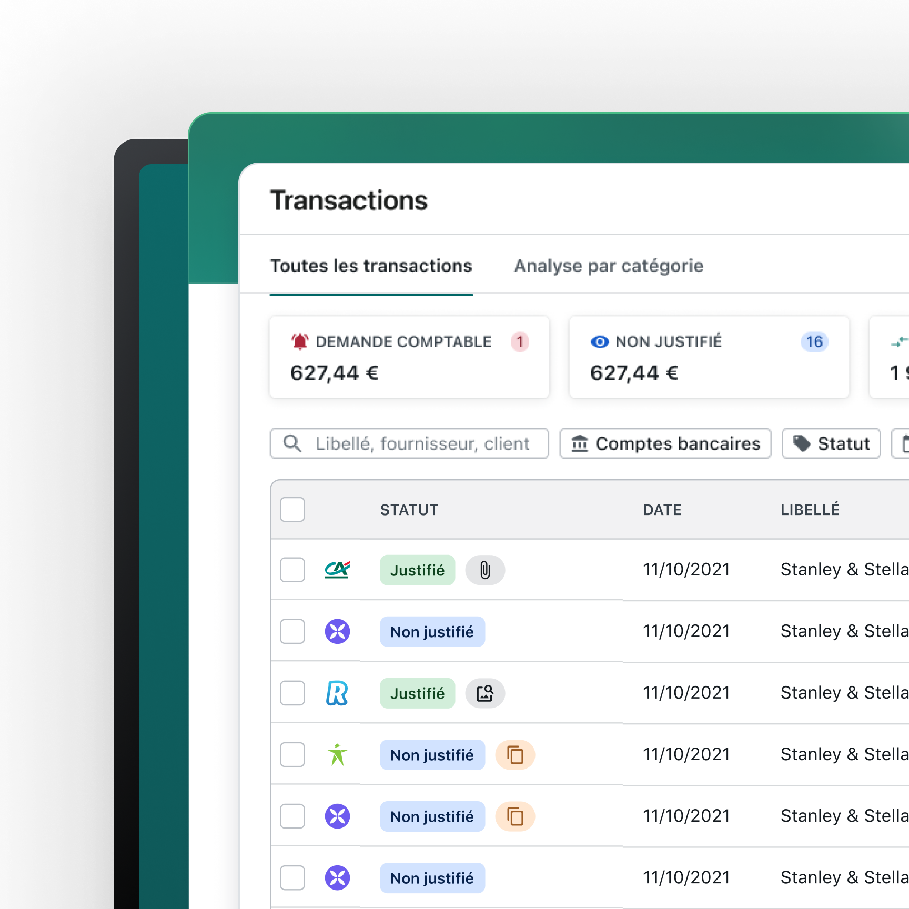
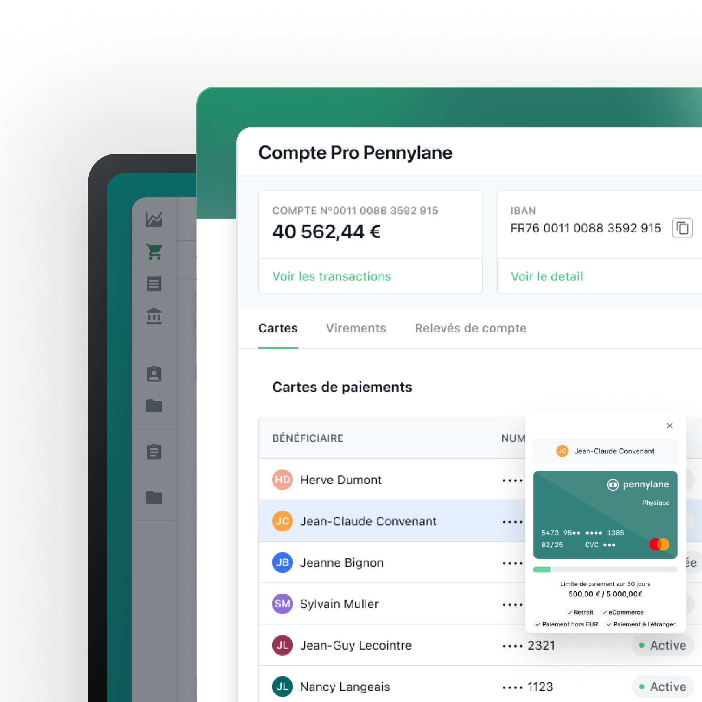
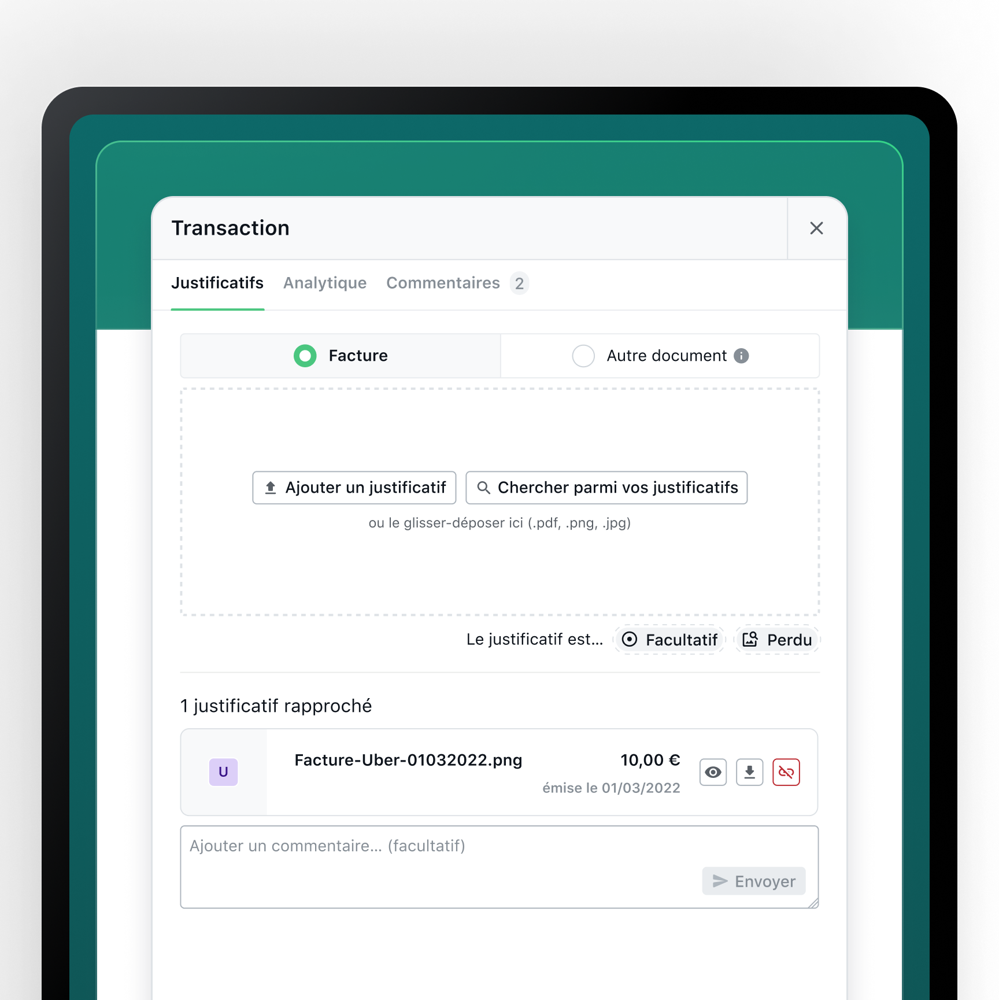
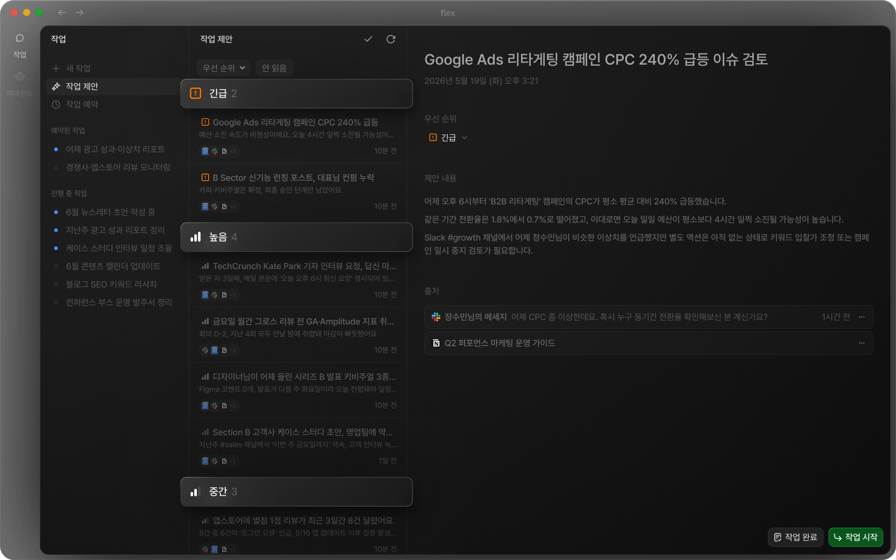
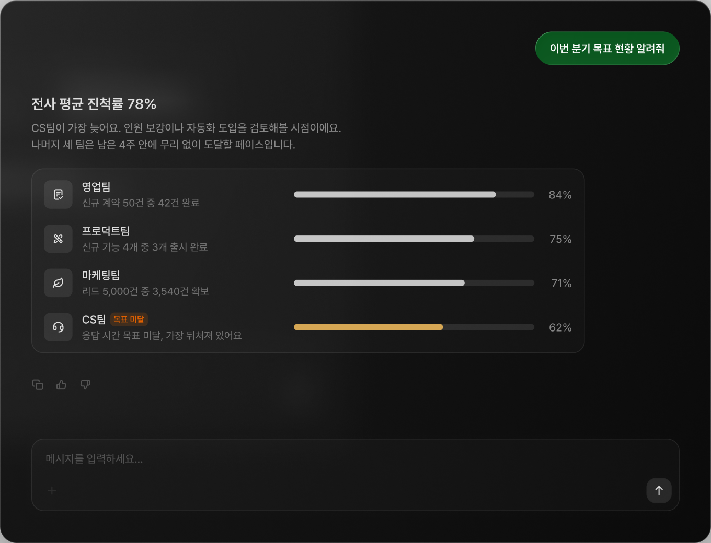
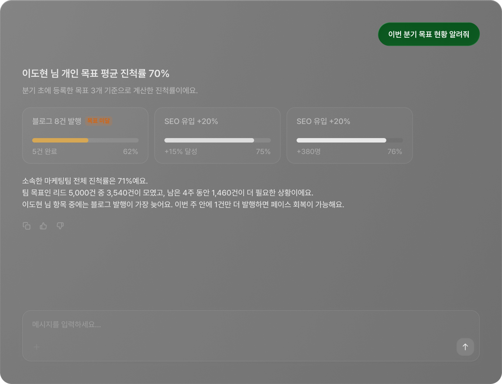
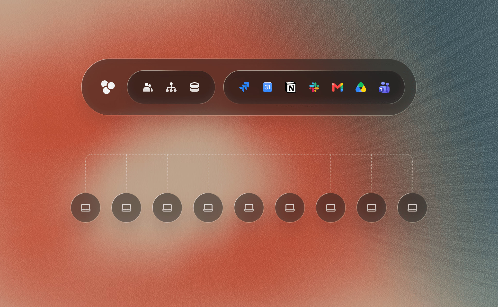

# askim-erp 디자인 리뉴얼 — 레퍼런스 모음

> 작성: 2026-06-23 · 목적: 전면 디자인 리뉴얼의 레퍼런스/방향 정리.
> 이후 claude design 입력 및 디자인 시스템(토큰) 정의의 기준 문서로 사용.

---

## 0. 한눈에 보기

| 레퍼런스 | 무엇을 참고 | 스샷 확보 |
|---|---|---|
| **flex.team** | 디자인 *철학* + 2026 AI 제품 UI(다크), 리스트+상세 패널, 진척 대시보드 | ✅ 6장 (아래) |
| **Pennylane** | 데이터 테이블, 상태 배지, 필터바, 사이드바, 요약 카드 (라이트) | ✅ 4장 (아래) |
| **Linear** | 사이드바·키보드 중심·다크모드 톤 | ❌ 정적 스크래핑 불가 → 링크 |
| **Ramp** | 핀테크 대시보드 정보 밀도 | ❌ 정적 스크래핑 불가 → 링크 |

> ⚠️ Linear/Ramp는 마케팅 페이지가 실제 UI를 JS로 렌더해 정적 다운로드 안 됨 → 출처 링크만.
> flex는 raw HTML에서 실제 제품 카드 이미지 6장 확보(`static.flex.team`). Pennylane은 회계/ERP라 우리 케이스(deals/counterparties 테이블)와 가장 닮음.

### ✅ 결정: 라이트(화이트) base (2026-06-23)
- **base = 화이트/라이트.** 다크모드는 채택 안 함.
- 따라서 1순위 비주얼 레퍼런스는 **Pennylane(라이트)** 계열.
- flex 다크 스샷은 *구조*(리스트+상세 패널, 진척 바, 카드 레이아웃)만 차용하고 컬러는 라이트로 변환.

---

## 1. Pennylane (★ 핵심 레퍼런스 — 실제 제품 UI)

회계/재무 SaaS. 우리처럼 **목록·테이블·상태관리** 중심이라 가장 직접적인 참고 대상.

### 1-1. 거래 목록 테이블 — `assets/pennylane-allinone.png`


뜯어볼 점:
- **상단 요약 카드**: `DEMANDE COMPTABLE 627,44€` 식으로 핵심 지표를 카드로. 아이콘+라벨(소문자 캡스)+큰 숫자.
- **필터바**: 검색(`Libellé, fournisseur, client`) + `Comptes bancaires` + `Statut` 칩 버튼 한 줄 배치.
- **테이블**: 체크박스 / 아바타(은행·거래처 컬러 아이콘) / **상태 배지**(`Justifié` 초록, `Non justifié` 회색) / 날짜 / 라벨.
- **밀도**: 행 높이 적당, 구분선 옅게. 정보 많아도 시각 노이즈 낮음.
- **컬러**: 화이트 배경 + 그레이 텍스트 + **그린 강조**(상태/링크).

### 1-2. 계좌·카드 + 좌측 사이드바 — `assets/pennylane-compta.png`


- **좌측 아이콘 사이드바**: 좁은 폭, 아이콘만, 미니멀.
- **요약 박스**: 잔액 `40 562,44€` + IBAN, 우측에 `Voir les transactions` / `Voir le detail` 텍스트 링크(그린).
- **탭**: `Cartes / Virements / Relevés de compte` — 밑줄 활성 탭.
- **수혜자 리스트**: 이니셜 아바타 + 이름 + 상태(`Active` 그린 닷).

### 1-3. 거래 상세 모달 — `assets/pennylane-gestion.png`


- **모달/패널 상세**: 헤더 `Transaction` + X 닫기, 탭(`Justificatifs / Analytique / Commentaires`).
- 토글형 라디오(`Facture` ↔ `Autre document`), 첨부 영역(드래그&드롭 힌트), 코멘트 입력.
- 우리 deal 상세 패널 설계 시 그대로 참고 가능.

### 1-4. 대시보드/인사이트 합성 — `assets/pennylane-header.png`


- 차트(바·파이·라인) 위주 인사이트 화면. 그린 단색 강조로 톤 통일.

---

## 2. flex.team (디자인 철학 + 2026 AI 제품 UI)

출처: <https://flex.team> · 디자인 블로그 <https://flex.team/blog/2025/07/02/2025-07-02-design/>
폰트: **Pretendard** (한글 최적화 가변폰트 — 우리도 채택 검토 가치 ↑)

### 2-1. 작업 제안 — 리스트 + 상세 패널 (★ 다크) — `assets/flex-content2-card1.png`

- **좌측 우선순위 리스트**(긴급/높음/중간 섹션 그룹핑) + **우측 상세 패널** 2분할.
- 다크 배경, 카드 행에 아이콘+제목+메타, 우하단 그린 액션 버튼(`작업 시작`).
- 우리 deals 목록→상세 흐름에 그대로 매핑 가능한 구조.

### 2-2. 전사 진척 대시보드 — `assets/flex-content1-card2.png`

- 부서별 진척률 바(영업 84% / 프로덕트 75% / 마케팅 71% / CS 62%) — 미달 항목 **오렌지 강조**.
- 다크 카드 + 그린 1색 강조 + 오렌지 경고색. 우상단 액션 버튼.

### 2-3. 개인 목표 진척 카드 — `assets/flex-content1-card1.png`

- 진척률 + 설명 + 채팅형 입력(AI). 카드 하단 입력바 패턴.

### 2-4. 통합(Integration) 다이어그램 — `assets/flex-content3-card1.jpg`

- Jira·Notion·Slack·Gmail·Drive·Teams 연동 시각화(장식성 ↑). 톤 참고용.

### 비주얼 톤
- **2026 랜딩 = 다크 테마** + 그린 강조 + 오렌지 경고. 시크/프리미엄.
- 굵은 산세리프(Pretendard) 헤딩 + 넉넉한 줄높이. 경계선 최소, 여백 넉넉.

### 디자인 원칙 (★ 리뉴얼 기준 삼을 것)
```
기능 중심 ❌  →  사용자 맥락 중심 ⭐

화면 설계 3질문:
 1. 이 화면을 쓰는 사람은 누구인가? (구성원 / 담당자 / 경영진)
 2. 이 정보가 "이 타이밍"에 정말 필요한가?
 3. 그 흐름이 자연스럽게 읽히는가?
```
핵심: **복잡한 도메인을 단순하게.** 정보 밀도는 높이되 흐름은 깔끔하게.

---

## 3. Linear (보조 — 사이드바/키보드/다크 톤)

출처: <https://linear.app>
- 다크모드 기반, 중성톤 + 밝은 액센트.
- 좌 사이드바 네비 / 중앙 리스트 / 우 상세 패널 3분할.
- 이슈 리스트 = 상태 배지 + 라벨. 키보드 우선 인터랙션.
> 정적 스크래핑 불가(JS 렌더). 직접 접속해 확인 권장.

## 4. Ramp (보조 — 핀테크 대시보드 밀도)

출처: <https://ramp.com>
- 금융 데이터 테이블/대시보드 정보 밀도 참고용.
> 정적 스크래핑 불가. 직접 접속해 확인 권장.

---

## 5. askim-erp 적용 방향 (초안)

| 영역 | 방향 | 출처 |
|---|---|---|
| **전체 톤** | 미니멀 + 프리미엄, 화이트 기반 | flex / Pennylane |
| **강조 컬러** | 단색 1개로 통일(브랜드색) — 상태/링크/활성탭에만 | Pennylane(그린) |
| **사이드바** | 좁은 아이콘 사이드바 또는 아이콘+라벨 | Pennylane / Linear |
| **데이터 테이블** | 체크박스+아바타+상태 배지+옅은 구분선, 밀도↑ 노이즈↓ | Pennylane |
| **필터바** | 검색 + 칩 버튼 한 줄 | Pennylane |
| **요약 카드** | 목록 상단 핵심 지표 카드 | Pennylane |
| **상세 화면** | 우측 패널/모달 + 탭 구성 | Pennylane |
| **타이포** | 산세리프, 볼드로 위계, 넉넉한 줄높이 | flex |
| **설계 기준** | 화면별 "누가/언제/왜" 먼저 정의 | flex 3질문 |

---

## 6. 다음 단계
- [ ] 이 문서 검토 → 방향 확정/수정
- [ ] (옵션) 레퍼런스 추가 — 직접 접속 스샷 등
- [ ] 디자인 시스템 토큰 정의 (컬러/타이포/spacing/radius)
- [ ] claude design으로 시스템 생성 → 실제 컴포넌트 반영
